# System Architecture & Requirements

This document outlines the high-level system architecture, component breakdown, and non-functional requirements of the **CloudShare** application.

---

## 1. High-Level Architecture Topology

CloudShare is designed as a secure, stateless, multi-tier web application. To ensure student friendliness (zero hosting costs) while keeping the architecture production-ready, it supports both a Docker-Compose self-hosted environment and a cloud-native equivalent.

```mermaid
graph TD
    Client(["🖥️ Client Browser / JS App"])

    subgraph Edge["🌐 Edge & Security Layer"]
        Nginx["Nginx Reverse Proxy / WAF"]
    end

    subgraph AppTier["⚙️ Application Tier (Stateless)"]
        SpringApp1["Spring Boot App Instance 1"]
        SpringApp2["Spring Boot App Instance 2"]
    end

    subgraph SecuritySvc["🛡️ Security Services"]
        ClamAV["ClamAV Virus Scanner Daemon"]
    end

    subgraph DataTier["💾 Data & Storage Tier"]
        Postgres[("PostgreSQL Relational DB")]

        subgraph RedisTier["Redis Tier — 3 isolated instances"]
            RedisCache[("cache-aside\nallkeys-lru")]
            RedisSecurity[("cache-security\nnoeviction")]
            RedisRateLimit[("cache-ratelimit\nallkeys-lru")]
        end

        subgraph StorageLayer["Pluggable Storage Layer"]
            MinIO[("Self-Hosted MinIO S3 Container")]
            LocalStorage[("Local Host Filesystem")]
        end
    end

    %% Interactions
    Client -->|HTTPS / TLS 1.3| Nginx
    Nginx -->|Load Balancing / HTTP| SpringApp1
    Nginx -->|Load Balancing / HTTP| SpringApp2

    %% Backend Integrations
    SpringApp1 & SpringApp2 -->|Read/Write Metadata| Postgres
    SpringApp1 & SpringApp2 -->|App Caching| RedisCache
    SpringApp1 & SpringApp2 -->|Token Blacklist & MFA Replay Defense| RedisSecurity
    SpringApp1 & SpringApp2 -->|Sliding-Window Rate Limits| RedisRateLimit
    SpringApp1 & SpringApp2 -->|Synchronous Virus Scan| ClamAV

    %% Storage access
    SpringApp1 & SpringApp2 -->|Write Files / Direct Disk I/O| LocalStorage
    SpringApp1 & SpringApp2 -->|S3 API / Upload & Download| MinIO

    %% Styling
    classDef client fill:#eef2ff,stroke:#4338ca,stroke-width:2px,color:#1e1b4b
    classDef edge fill:#0f766e,stroke:#134e4a,stroke-width:2px,color:#f0fdfa
    classDef app fill:#1d4ed8,stroke:#1e3a8a,stroke-width:2px,color:#eff6ff
    classDef security fill:#b91c1c,stroke:#7f1d1d,stroke-width:2px,color:#fef2f2
    classDef db fill:#7c3aed,stroke:#4c1d95,stroke-width:2px,color:#f5f3ff
    classDef cacheAside fill:#2563eb,stroke:#1e3a8a,stroke-width:2px,color:#eff6ff
    classDef cacheSecurity fill:#dc2626,stroke:#7f1d1d,stroke-width:2px,color:#fef2f2
    classDef cacheRate fill:#d97706,stroke:#78350f,stroke-width:2px,color:#fffbeb
    classDef storage fill:#059669,stroke:#065f46,stroke-width:2px,color:#ecfdf5

    class Client client
    class Nginx edge
    class SpringApp1,SpringApp2 app
    class ClamAV security
    class Postgres db
    class RedisCache cacheAside
    class RedisSecurity cacheSecurity
    class RedisRateLimit cacheRate
    class MinIO,LocalStorage storage

    style Edge fill:#f0fdfa,stroke:#0f766e,stroke-width:1px
    style AppTier fill:#eff6ff,stroke:#1d4ed8,stroke-width:1px
    style SecuritySvc fill:#fef2f2,stroke:#b91c1c,stroke-width:1px
    style DataTier fill:#faf5ff,stroke:#7c3aed,stroke-width:1px
    style RedisTier fill:#fffbeb,stroke:#d97706,stroke-width:1px,stroke-dasharray: 3 3
    style StorageLayer fill:#ecfdf5,stroke:#059669,stroke-width:1px,stroke-dasharray: 3 3
```

### Component Breakdown

1.  **Client Tier:** A responsive web application built with modern JS/HTML/CSS. Following the v2.0.0 frontend architecture refactor, the monolithic client script (`app.js`) is modularized into cohesive ES modules:
    *   `state.js`: Defines the single shared frontend state object, exported as a true singleton.
    *   `shared.js`: Holds stateless UI utility helpers (e.g., notifications/toast rendering, formatting).
    *   `session.js`: Handles session lifecycle (JWT payload extraction, login state checks, navigation bar rendering).
    *   `router.js`: The Single-Page Application (SPA) client-side router mapping hash parameters.
    *   `views/*.js`: View controllers are partitioned by functionality (`auth.js`, `dashboard.js`, `sharing.js`, `mfa.js`, `admin.js`) to isolate page-specific DOM generation.
    It communicates with the backend solely via a secure REST API.
2.  **Reverse Proxy / Edge Layer (Nginx):** 
    *   Terminates TLS/SSL connections (TLS 1.3 strictly enforced).
    *   Serves static frontend assets.
    *   Forwards API requests (`/api/*`) to the Spring Boot application cluster.
    *   Implements basic rate limiting, request buffering, and client header security configurations.
3.  **Application Tier (Spring Boot):**
    *   Stateless application nodes executing business logic.
    *   Integrates Spring Security for authentication and authorization.
    *   Scales horizontally as load increases.
4.  **Security Services (ClamAV):**
    *   A lightweight antivirus daemon exposed via a TCP socket.
    *   Spring Boot streams files to ClamAV during the upload pipeline *before* storing them or saving metadata.
5.  **Cache & Security Tier (Triple Redis Mappings):**
    *   **Redis Cache-Aside Node (`cache-aside`):** Stores user metadata, JPA queries, and resource access permissions with LRU eviction policies to prevent database lookup hotspots.
    *   **Redis Security Node (`cache-security`):** Stores JWT blacklists, single-use step-up token enforcement, and MFA/TOTP anti-replay tracking with a strict `noeviction` policy to preserve session and access control integrity.
    *   **Redis Rate-Limit Node (`cache-ratelimit`):** Stores sliding-window rate-limit counters (auth, MFA, upload, public link — per-link and global) on its own `allkeys-lru` instance, introduced in v1.2.0 to isolate high-write rate-limiter traffic from security-critical token state so rate-limiter volume can never trigger OOM-driven failures in unrelated security enforcement paths.
6.  **Database Tier (PostgreSQL):**
    *   Houses relational schemas for users, credentials, roles, file metadata (names, paths, hash sums, sizes), permissions, and audit logs.
7.  **Storage Tier (Pluggable):**
    *   **Local Filesystem (Free/Local Dev):** Files are stored in a sandboxed, isolated directory outside the web application's root directory, with UUID-based filenames to prevent path traversal.
    *   **MinIO (Free S3-Compatible Dev):** A local, lightweight container exposing S3-compatible APIs. Enables local testing of cloud-ready storage pipelines at no cost.
    *   **AWS S3 (Cloud Production):** Standard enterprise storage. The storage adapter can switch to AWS S3 via configuration flags.

---

## 2. Functional Requirements

### User & Session Management
*   **Registration & Activation:** Users can sign up and verify their email.
*   **Authentication:** Multi-factor authentication (MFA) capability using TOTP. Stateless session handling utilizing JSON Web Tokens (JWT) with Refresh Token rotation.
*   **Role-Based Access Control (RBAC):** Define roles (e.g., `ROLE_USER`, `ROLE_ADMIN`) determining system operation allowances.

### File Operations
*   **Secure Upload:** Upload files via chunked transfer, with filename sanitization, MIME-type checks, and automatic virus scan checks.
*   **Secure Download:** Stream files securely from the storage backend. Prevent unauthorized downloads through cryptographic link validation or active session authorization.
*   **File Lifecycle Management:** Metadata tracking, physical file deletion (with soft-delete options), renaming, and directory structuring.

### Sharing Capabilities
*   **Direct Share:** Share files with other registered users by inputting their username/email.
*   **Public Share Link:** Generate secure links accessible to non-users. Features:
    *   Optional password protection.
    *   Configurable expiration times (e.g., 1 hour, 1 day, 7 days).
    *   One-time download limits (the link self-destructs after download).

### Auditing & Compliance
*   **Audit Logging:** Strict tracking of all operations (who uploaded, who downloaded, when, from which IP, etc.).

---

## 3. Non-Functional Requirements (NFRs)

### Security
*   **Zero Clear-text Storage:** Passwords hashed with `BCrypt` (work factor 12).
*   **Data Isolation:** Raw files must never be accessible directly via web paths. Files are stored using random UUIDs; the original filenames are kept only in the database.
*   **Input Validation:** Strict constraint validation at the API Gateway and Controller levels using Hibernate Validator.

### Scalability & Performance
*   **Horizontal Scaling:** Backend nodes are stateless and can scale dynamically based on CPU/Memory usage.
*   **Database Pool Management:** HikariCP connection pooling configured with optimal thresholds.
*   **Low Memory Footprint Uploads:** File uploads must stream directly to the target storage (Local Disk/MinIO) via input streams, preventing entire file buffers from loading into the Java heap.

### Availability & Durability
*   **Target Availability:** 99.9% uptime.
*   **Data Durability (99.999%):** Secured by storing files in MinIO with erasure coding or cloud S3 with multi-AZ replication.
*   **Recovery Targets:** 
    *   Recovery Point Objective (RPO): < 1 hour (backed up via PostgreSQL WAL archiving).
    *   Recovery Time Objective (RTO): < 4 hours.
