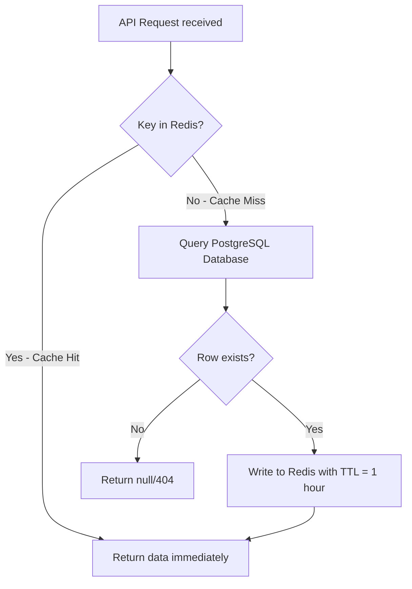

# Caching & Rate Limiting Strategy

To prevent relational database saturation and block malicious scraping or brute-force attacks, CloudShare deploys **Redis** as an in-memory cache and rate-limiting store.

---

## 1. Triple-Redis Split Instance Architecture

To prevent eviction of security-critical keys (like JWT blacklists and refresh tokens) under memory pressure, and to isolate high-write rate limiter volume, CloudShare deploys **three separate physical/logical Redis instances** with tailored configurations:

1.  **Redis Cache (`cache-aside`)**: Holds transient business objects. Allows key eviction when RAM limits are reached.
2.  **Redis Security (`cache-security`)**: Holds JWT blacklists, refresh token session states, and MFA anti-replay records. Strict `noeviction` policy enforces security rules.
3.  **Redis Rate-Limiting (`cache-ratelimit`)**: Holds sliding-window rate limit counters. Eviction is enabled (`allkeys-lru`) to bound memory consumption under DDoS workloads.

| Target Instance | Dataset Category | Redis Key Pattern | Data Structure | TTL | Eviction Policy |
| :--- | :--- | :--- | :--- | :--- | :--- |
| **Redis Security** | **Revoked / Single-Use JWTs** | `blacklist:token:<jti>` | String | Token expiry | **No Eviction** |
| **Redis Security** | **MFA TOTP Anti-Replay** | `mfa:used:<userId>:<sha256Hex(code)>` | String | 90 Seconds | **No Eviction** |
| **Redis Rate-Limiting** | **API Rate Limits** | `limit:<ip_or_userid>:<endpoint>` <br> `limit:link:<shareCode>:<ip>` <br> `limit:linkglobal:<ip>` | Sorted Set | 1 Minute | `allkeys-lru` |
| **Redis Cache** | **Cache-Aside Metadata** | `cache:user:<id>` <br> `cache:permissions:<file_id>` | Hash / String | 1 Hour | `allkeys-lru` |
| **Redis Cache** | **Eviction Bypass Marker** | `cache:permissions:bypass:<file_id>` | String | 10 Minutes | `allkeys-lru` |


---

## 2. The Cache-Aside Pattern

For performance optimization on database queries (e.g., checking user metadata or resolving file access permissions during downloads), the application follows the **Cache-Aside** architecture:



### Cache Invalidation Rules & Fail-Loud Self-Healing:
To prevent dirty reads (returning outdated permissions or details), we implement active invalidation:
*   **PermissionCacheService Encapsulation:** Following the v2.0.0 refactor, all Redis permission caching mechanics (cache-aside read/write, write-through eviction, bypass-marker tracking, and self-healing) are isolated inside the standalone `PermissionCacheService` class, preventing logic drift between `FileService` and `ShareService`.
*   **Write-Through Eviction:** Whenever file access permissions are modified (`POST /api/v1/shares/internal`), updated, or a file is soft-deleted, `PermissionCacheService.evict(fileId)` is invoked to delete the corresponding Redis key (`cache:permissions:<file_id>`) in the same transaction.
*   **Eviction Failure Bypass Marker (Fail-Loud Self-Healing):** If eviction fails (e.g. transient Redis network issue), `PermissionCacheService` sets a 10-minute bypass marker (`cache:permissions:bypass:<file_id>`). When present, subsequent reads via `PermissionCacheService.getCachedPermission` bypass the stale cache, routing the query directly to PostgreSQL, and attempt a self-healing eviction of both the stale cache and bypass marker.
*   **Cache Failure Logging Tags:** Cache-related errors are logged with distinct tags to isolate critical risks from normal fallback events:
    *   `[PERMISSION_CACHE_EVICTION_FAILED]`: Logged when a cache eviction fails during share creation or revocation (indicates stale permission caching risk; triggers high-priority alerts).
    *   `[PERMISSION_CACHE_READ_FAILED]`: Logged when a cache read fails due to timeout or connection drops (benign fallback to DB occurs; excluded from paging alerts).
*   **No Cache for Files:** The binary streams of files are *never* stored in Redis. Redis is strictly reserved for metadata, session IDs, and rate limit counters.

---

## 3. Distributed Rate Limiting (Token Bucket / Sliding Window)

To protect critical endpoints (such as authentication or file downloads) from Denial of Service (DoS) and brute-force attacks, CloudShare implements a **Sliding Window Counter** rate limiter in Redis.

To ensure atomic transactions under high concurrency, rate evaluation is executed via a **Redis Lua Script**:

```lua
-- KEYS[1] = Rate limit key (e.g., "limit:192.168.1.50:/auth/login")
-- ARGV[1] = Current Unix timestamp (seconds)
-- ARGV[2] = Window size (seconds, e.g., 60)
-- ARGV[3] = Max allowed requests in window (e.g., 5)

local key = KEYS[1]
local now = tonumber(ARGV[1])
local window = tonumber(ARGV[2])
local limit = tonumber(ARGV[3])

local clear_before = now - window

-- Remove requests outside the sliding window
redis.call('ZREMRANGEBYSCORE', key, '-inf', clear_before)

-- Count total requests in the window
local current_requests = redis.call('ZCARD', key)

if current_requests < limit then
    -- Add the current request timestamp as score and value
    redis.call('ZADD', key, now, now)
    -- Extend key expiration to cover window duration
    redis.call('EXPIRE', key, window)
    return 1 -- Allowed
else
    return 0 -- Rate limit exceeded
end
```

### 3.1 Rate Limit Thresholds:
*   **Authentication Routes (`POST /api/v1/auth/login`, `/register`, `/refresh`):** Max 5 attempts per minute per IP.
*   **MFA Verification & Step-Up (`POST /api/v1/auth/mfa/verify`, `/step-up`):** Max 5 attempts per minute per User ID (or IP).
*   **File Upload Routes (`POST /api/v1/files/upload`):** Max 10 uploads per minute per User ID (or IP).
*   **Public Link Access (`GET /api/v1/shares/link/*`):** Two-tier rate limiting:
    1.  *Per-Link Limit (`limit:link:<shareCode>:<ip>`):* Max 30 requests per minute.
    2.  *Global Link Limit (`limit:linkglobal:<ip>`):* Max 100 requests per minute across all public link endpoints.
*   **General REST APIs:** Max 100 requests per minute per User ID (or IP).

### 3.2 Client IP Resolution & Spoofing Protection (H2 / C2)
For unauthenticated rate limiting (e.g., login attempts, public share link accesses), the application maps rate-limiting buckets using client IP addresses.

To guarantee the integrity of these IP-keyed rate limits and prevent attackers from spoofing their source address via custom headers, CloudShare relies on a secure network design:
1. **Gateway Trust Assumption (C2):** The Spring Boot application container (`app:8080`) is not exposed publicly to the host or internet. All inbound traffic must pass through the Nginx API gateway (`gateway:443`).
2. **IP Header Overwriting:** Nginx unconditionally overrides the incoming `X-Real-IP` and `X-Forwarded-For` HTTP headers with the socket's actual connection IP (`$remote_addr`) before forwarding requests upstream to the app:
   ```nginx
   proxy_set_header X-Real-IP $remote_addr;
   proxy_set_header X-Forwarded-For $remote_addr;
   ```
3. **Application IP Resolution:** The backend `ClientIpResolver` reads the `X-Real-IP` header. Since direct access to the app container port is blocked by the network topology, the application can safely trust the `X-Real-IP` header because Nginx is guaranteed to have populated it securely from the actual remote client IP.

This design ensures IP rate limiting is fully protected against header-spoofing bypass attacks.

---

## 4. Redis Configuration & Tuning Spec

The three Redis instances are configured with distinct memory limits, eviction policies, and passwords to guarantee security and system reliability under load.

### 4.1 Redis Cache Config (`cache-aside`)
*   **Max Memory:** 256MB.
*   **Max Memory Policy:** `allkeys-lru` (Least Recently Used). If memory limit is reached, Redis evicts the oldest user profiles or permission caches to make room for new metadata.
*   **Tuning Properties:**
    ```properties
    maxmemory 268435456
    maxmemory-policy allkeys-lru
    requirepass <configured_password>
    ```

### 4.2 Redis Security Config (`cache-security`)
*   **Max Memory:** 256MB.
*   **Max Memory Policy:** `noeviction`. Security records (such as blacklisted JWT IDs and MFA anti-replay keys) must never be dropped dynamically. If memory is full, new write requests fail with an Out-of-Memory error, protecting the application from brute-force floods or replay attacks bypassing checks.
*   **Tuning Properties:**
    ```properties
    maxmemory 268435456
    maxmemory-policy noeviction
    requirepass <configured_password>
    ```

### 4.3 Redis Rate-Limiting Config (`cache-ratelimit`)
*   **Max Memory:** 128MB.
*   **Max Memory Policy:** `allkeys-lru` (Least Recently Used). Ephemeral rate-limit counters can be safely evicted under extreme memory pressure since standard gateway limits still provide secondary protection.
*   **Tuning Properties:**
    ```properties
    maxmemory 134217728
    maxmemory-policy allkeys-lru
    requirepass <configured_password>
    ```
*   **Alerting:** Prometheus monitors `redis_memory_used_bytes` for all three instances. If usage exceeds 80% on any node, an automated alert triggers to notify operators to allocate more memory.

### 4.4 Lettuce Client Connection Pooling & Timeout Config

To prevent thread-blocking resource exhaustion and configure appropriate fail-safe profiles, Lettuce connections are pooled and tuned using environment-overridable properties:

*   **Connection Pool Sizing (All Instances):**
    *   `max-total`: 16 (maximum active connections allowed in the pool).
    *   `max-idle`: 8 (maximum idle connections kept in the pool).
    *   `min-idle`: 2 (minimum idle connections pre-warmed and maintained).
*   **Command Timeout & Failure Semantics:**
    *   **`cache-aside`:** Timeout defaults to `2000ms`. Slower timeouts are acceptable as it is a read-through fallback; transient blips should not force redundant DB hits.
    *   **`cache-security`:** Timeout defaults to `2000ms`. Security check operations run fail-closed (meaning if Redis is unavailable, requests fail). A standard timeout ensures transient network drops do not block legitimate requests too aggressively.
    *   **`cache-ratelimit`:** Timeout defaults to `500ms`. Rate-limiting runs fail-open (meaning if the Redis check times out or fails, the request is allowed through). A fast timeout policy ensures that rate-limit congestion never stalls standard application endpoints.

