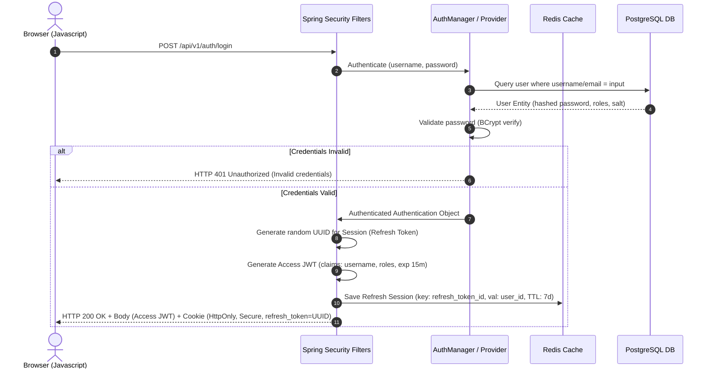
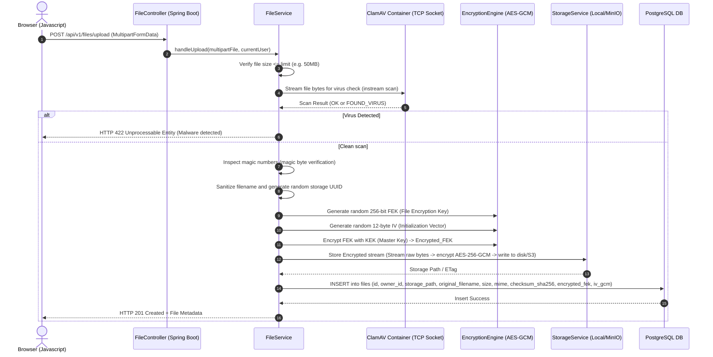
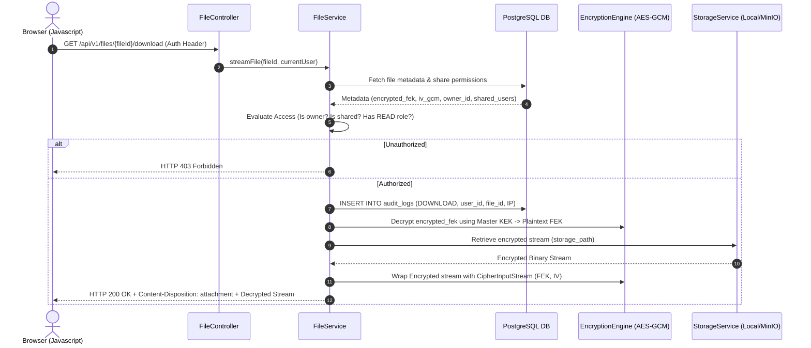
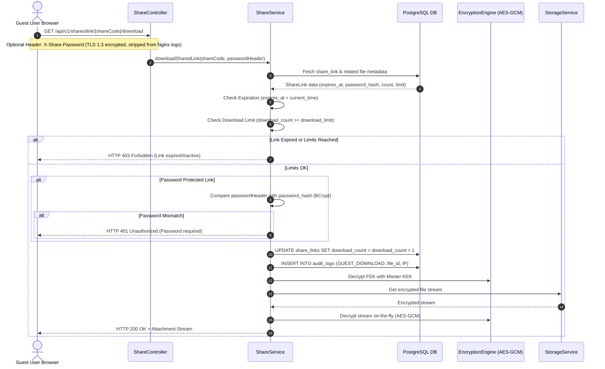
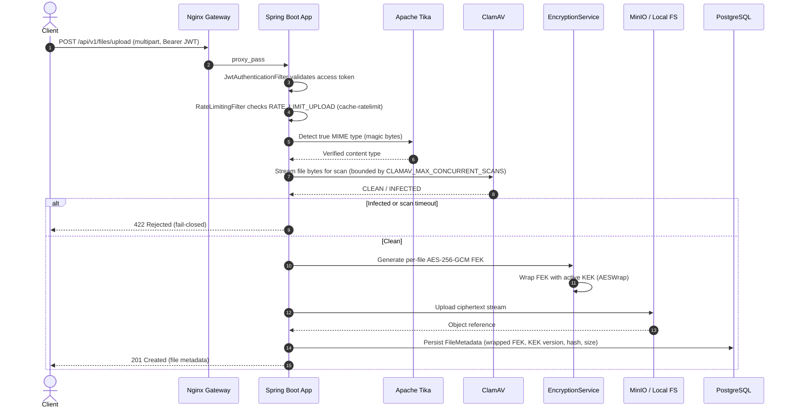
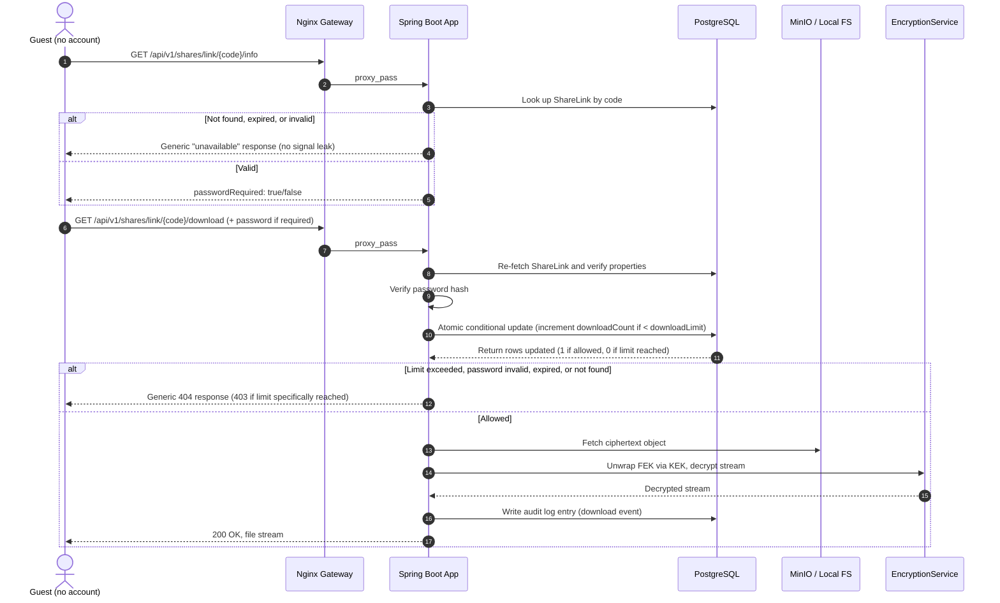

# Core Data Flows & Sequence Diagrams

This document contains step-by-step sequence diagrams showing the interaction between the Client, Spring Boot Application, Spring Security, Redis, ClamAV, the Database, and the Storage backend for key system operations.

> **Note:** Sections 5 and 6 below reflect the **current v1.2.0 behavior** for upload and public-link download, including the fail-closed AV scan, Tika MIME verification, and the enumeration-safe `/info` + atomic download-limit check introduced during the security audit remediation cycle. Sections 2 and 4 predate that cycle and are kept for historical reference — consider consolidating or removing them once verified against the current codebase.

---

## 1. User Authentication & Session Setup

This diagram shows how users log in and how their access and refresh sessions are established.

---

## 2. Secure File Upload Pipeline

During file upload, the application stream is processed sequentially: virus scanned, verified for MIME types, encrypted on the fly, stored, and cataloged.

---

## 3. Secure File Decryption & Download

File downloads must never allow direct file access. Decryption is performed in memory while streaming.

---

## 4. Secure Shared Link Verification

This flow describes accessing shared resources securely using short-lived codes with credentials.

---

## 5. Encrypted Upload with AV Scan (Current — v1.2.0)

This is the up-to-date upload flow, showing the fail-closed ClamAV gate, Tika-verified MIME type, and per-file envelope encryption via the active KEK version.

---

## 6. Public Share Link Download (Current — v1.2.0, Enumeration-Safe)

This is the up-to-date public link flow, reflecting the audit-driven `/info` + `/download` split (which prevents share-code enumeration) and the atomic, TOCTOU-hardened download-limit check.

