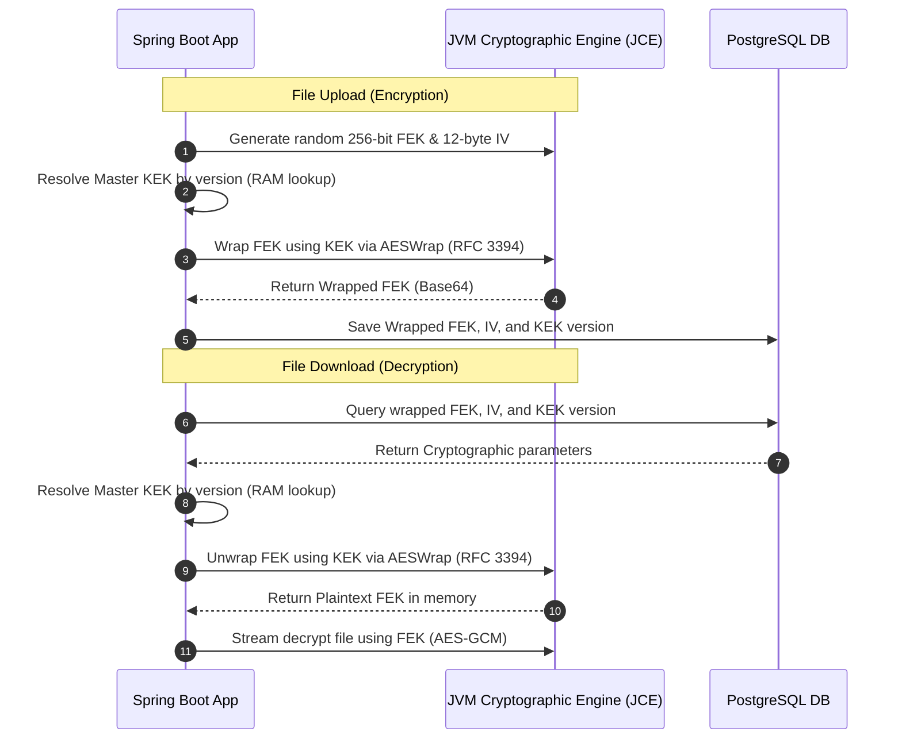
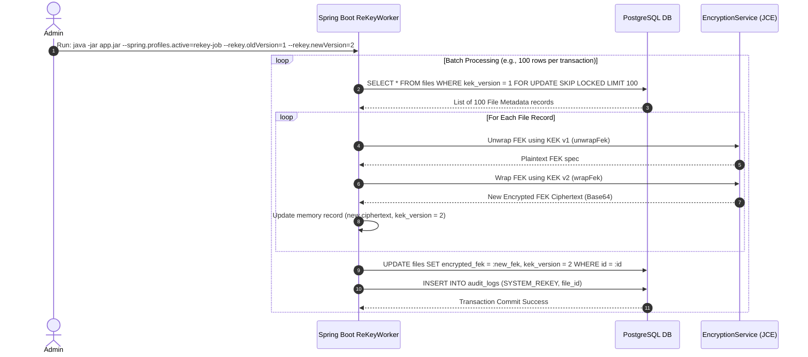

# Key Management & Secrets Rotation

In a secure file-sharing system, encrypting files is only as secure as the management of the cryptographic keys themselves. This document specifies the secrets hierarchy, integration with external Key Management Services (KMS), and key rotation operations.

---

## 1. Secrets Hierarchy

CloudShare divides configuration secrets and cryptographic keys into distinct security classifications:

```
+---------------------------------------------------------------------------------+
| Level 3: Master KEK (Key Encryption Key)                                        |
| Managed externally (AWS KMS / HashiCorp Vault). Never enters application RAM.  |
+---------------------------------------------------------------------------------+
                                      |
                                      v (Encrypts / Decrypts)
+---------------------------------------------------------------------------------+
| Level 2: FEKs (File Encryption Keys)                                            |
| Unique AES-256 key per file. Stored encrypted in PostgreSQL.                    |
+---------------------------------------------------------------------------------+
                                      |
                                      v (Encrypts / Decrypts)
+---------------------------------------------------------------------------------+
| Level 1: Application Secrets & Config                                           |
| DB Passwords, Redis Tokens, JWT Secrets. Injected via K8s Secrets / Env.        |
+---------------------------------------------------------------------------------+
```

---

## 2. Local Key Encrypting Key (KEK) Resolution

To achieve robust cryptographic protection without external operational dependencies, CloudShare implements local JCE-based **Envelope Encryption** within the JVM boundaries.

Master **Key Encryption Keys (KEKs)** are externalized to environment variables and resolved at runtime by the `EncryptionService`:



### Key Management Design:
* **In-Memory Cache:** KEKs are loaded from the `crypto.masterKek` property or the versioned KEKs map (`crypto.keks`) in the configuration, parsed/decoded, and cached in a `ConcurrentHashMap` inside `EncryptionService`.
* **Key Wrapping (RFC 3394):** The FEK is wrapped using the local JCE provider initialized with `Cipher.getInstance("AESWrap")`. The resulting wrapped key ciphertext is saved to PostgreSQL, preventing raw FEK leakage in database tables.
* **Fail-Closed Shape Validation:** At startup, `SecretsStartupValidator` validates the shape of all configured keys. If a key is not exactly 32 Base64-decoded bytes, startup is aborted unless `crypto.kek.allow-raw-passphrase=true` is set (which digests keys via SHA-256 and warns loudly).

---

## 3. Key Rotation Strategy

Cryptographic standards recommend rotating keys periodically (e.g., annually) or immediately upon suspected leakage. CloudShare supports two key rotation models:

### 3.1 Versioned Key Decryption (Recommended)
This approach avoids massive database write tasks by storing the key version identifier alongside the encrypted FEK.

*   **Database Schema Mapping:** The `files` table contains a `kek_version` integer column.
*   **Rotation Execution Flow:**
    1.  The security administrator triggers key rotation in the KMS (e.g., Vault generates a new version `v2` of the `cloudshare-kek`).
    2.  All subsequent file uploads call the KMS, which automatically encrypts the new FEK using `v2`. The application records `kek_version = 2` in PostgreSQL.
    3.  When a user downloads an old file (`kek_version = 1`), the application passes the ciphertext to the KMS. The KMS checks the metadata, routes it to the historical `v1` KEK, decrypts it, and returns the FEK.
    4.  No background data re-encryption is needed, resulting in zero performance degradation.

### 3.2 Full Re-Encryption Runbook (Compromise Recovery)
If a specific KEK version is leaked or compromised, versioned routing is not enough—all active FEKs encrypted under the compromised KEK must be decrypted and re-encrypted using the new KEK immediately.



#### 1. Concurrency & Locking Mechanics (`SKIP LOCKED`)
To prevent multiple application pods from processing the same files or creating lock contention, the database select query uses row-level locks:
```sql
SELECT * FROM files 
WHERE kek_version = :oldVersion 
  AND deleted = FALSE
FOR UPDATE SKIP LOCKED 
LIMIT 100;
```
*   `FOR UPDATE`: Locks the selected rows so no other process can modify them.
*   `SKIP LOCKED`: If another Spring Boot instance has already locked a batch of 100 rows, this query skips them entirely and fetches the next available 100 rows. This allows linear horizontal scaling of the re-keying process.

#### 2. Re-Keying Worker Implementation (Java Sketch)
```java
@Service
@RequiredArgsConstructor
public class ReKeyService {

    private final FileRepository fileRepository;
    private final EncryptionService encryptionService;
    private final AuditLogService auditLogService;

    @Transactional(propagation = Propagation.REQUIRES_NEW)
    public int processNextBatch(int oldVersion, int newVersion, Set<UUID> failedIds) {
        // Query utilizing FOR UPDATE SKIP LOCKED and excluding failed keys
        List<FileMetadata> batch = fileRepository.findBatchForReKey(oldVersion, failedIds, 100);
        if (batch.isEmpty()) {
            return 0;
        }

        for (FileMetadata file : batch) {
            try {
                // 1. Decrypt FEK using historical KEK version
                SecretKey fek = encryptionService.unwrapFek(file.getEncryptedFek(), oldVersion);
                
                // 2. Encrypt FEK using target KEK version
                String newCiphertext = encryptionService.wrapFek(fek, newVersion);
                
                // 3. Save new metadata
                file.setEncryptedFek(newCiphertext);
                file.setKekVersion(newVersion);
                fileRepository.save(file);
                
                // 4. Log audit log
                auditLogService.log(null, "SYSTEM_REKEY", file.getId(), "127.0.0.1", 
                        "Successfully re-keyed file metadata from KEK version " + oldVersion + " to " + newVersion);
                
                log.info("Successfully re-keyed file metadata. UUID: {}, New KEK Version: {}", file.getId(), newVersion);
            } catch (Exception e) {
                failedIds.add(file.getId());
                auditLogService.log(null, "SYSTEM_REKEY_FAILED", file.getId(), "127.0.0.1", e.getMessage());
            }
        }
        return batch.size();
    }
}
```
*   **Zero Downtime:** Users can upload and download files continuously during this runbook. Downloads of files not yet re-keyed transparently fetch `kek_version = 1`, while completed rows pull `kek_version = 2`.
*   **Writethrough Safety:** Physical file binary objects are never touched—only the 32-byte database keys are updated, meaning terabytes of storage remain intact without network IO overhead.

---

## 4. Application Configuration Secrets (Level 1)

For credentials (DB password, Redis token, SMTP credentials):
*   **Development:** Injected via a local `.env` file read by Docker-Compose (never committed to git).
*   **Production (Kubernetes):** Externalized using `Kubernetes Secrets` mapped as environment variables in the pod manifest.

---

## 5. Secrets Hygiene Audit & Verification History

A thorough audit of the project's entire Git history was performed on July 19, 2026. The findings are summarized below:
- **Git Commit History Analysis**: Audited all historical branches (`git log -p --all`) targeting `.env`, `.env.*`, and `application*.yml` configuration patterns.
- **Identified Secrets**:
  - Found that a temporary test environment file `tests/.env.ci` was committed in `1a4e35a7ab4ac786dce4f5118760e22b13a0d7c2` containing non-production/non-staging dummy parameters (e.g., `A1000Rocks` and `A1000Minio`) for automated CI testing.
  - This file was promptly removed in `fb57f06bdf335cf99930d9d90d0768d4df9bac46`.
  - No active, staging, or production credentials, KEKs, or signing keys have ever been committed.
- **Gitignore Enforcement**: Checked the history of `.gitignore` and confirmed `.env` has been actively ignored since the project's inception (`820d0a84e606ab0949df5f3eb3997a0486267445`). Additional staging settings (e.g. `.env.staging`, `tests/.env.staging`) were also verified to be correctly gitignored since commit `7d2b2717a100467c08ab8cf22e365930346d2b40`.
- **Verdict**: Clean. No active secret rotation or historical rewrite (`git filter-repo`) was required, as no real-world or production secrets were leaked.
