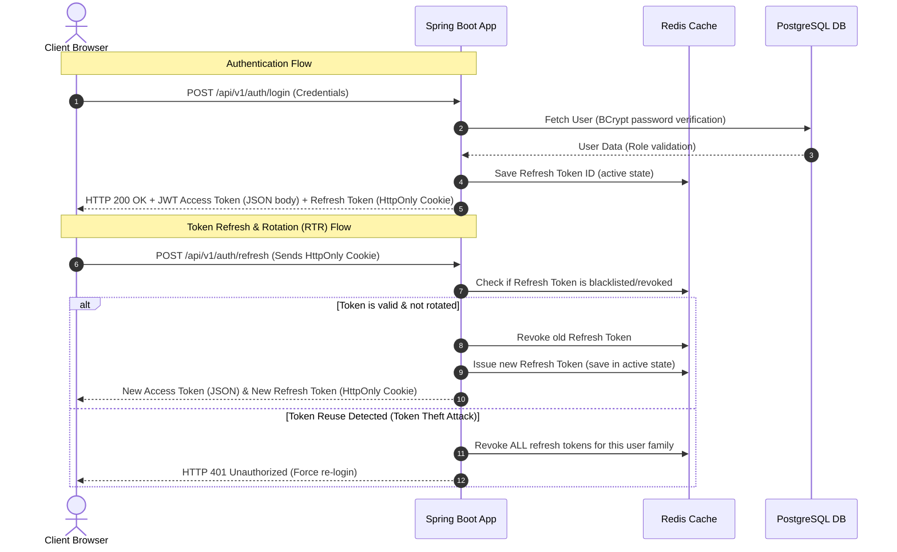
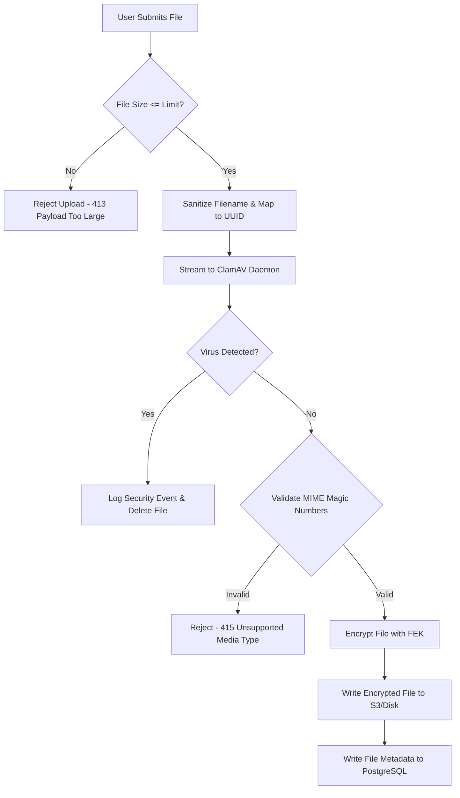

# Security Architecture

Security is the primary requirement of the **CloudShare** application. This document details the defense-in-depth strategies implemented across all tiers of the application to safeguard user identities, secure REST APIs, and protect stored files from theft and unauthorized access.

---

## 1. Authentication & Session Security

To combine modern REST API standard practices with high security, CloudShare implements stateless authentication using JSON Web Tokens (JWT) coupled with **Refresh Token Rotation (RTR)**.



### Detailed Token Management Protocol
1.  **Access Token:**
    *   **Lifetime:** 15 minutes (short-lived).
    *   **Payload:** Contains subject (User UUID), roles (`ROLE_USER`, `ROLE_ADMIN`), issued-at time, and expiration time. Signed with an HMAC SHA-256 or RSA-256 private key.
    *   **Storage:** Kept only in client-side memory (JavaScript variable). This isolates the access token from Cross-Site Scripting (XSS) extraction and prevents CSRF since it is not automatically sent by the browser.
2.  **Refresh Token:**
    *   **Lifetime:** 7 days (longer-lived).
    *   **Storage:** Sent to the client as an `HttpOnly`, `Secure`, `SameSite=Strict` cookie.
        *   `HttpOnly`: Prevents client-side scripts from reading the cookie, mitigating XSS theft.
        *   `Secure`: Ensures the cookie is only transmitted over HTTPS (TLS) connections.
        *   `SameSite=Strict`: Prevents the cookie from being sent on cross-site requests, mitigating Cross-Site Request Forgery (CSRF).
3.  **Refresh Token Rotation (RTR):**
    *   Every time a client requests a new Access Token using their Refresh Token, the Spring Boot backend generates a *new* Refresh Token and invalidates the old one.
    *   If a malicious actor steals a Refresh Token and tries to reuse it, the backend detects that the token was already consumed. To prevent breach, the backend immediately invalidates the entire token family (forcing both the legitimate user and the attacker to re-authenticate).
4.  **Credential Hashing:**
    *   All user passwords are encrypted using `BCrypt` with a work factor of 12 before database storage. Cleartext passwords are never logged, logged in memory, or stored.

### Multi-Factor Authentication (MFA) Enrollment Flow
CloudShare supports two-factor authentication using the **Time-Based One-Time Password (TOTP)** algorithm (RFC 6238).

1.  **MFA Setup (`POST /api/v1/auth/mfa/setup`):**
    *   The backend generates a cryptographically secure, random 160-bit secret key (Base32 encoded).
    *   It creates a standard key URI formatted as: `otpauth://totp/CloudShare:username?secret=SECRET&issuer=CloudShare&algorithm=SHA1&digits=6&period=30`.
    *   The URI is rendered as a Base64-encoded PNG QR code and returned to the frontend along with the raw secret.
    *   The secret key is stored in the database flagged as unverified (using a temporary staging column or pending state).
2.  **MFA Verification (`POST /api/v1/auth/mfa/verify`):**
    *   The user scans the QR code in their authenticator app (Google Authenticator, Authy, etc.) and submits the current 6-digit code.
    *   The backend calculates the expected code for the current time window (allowing a drift window of +/- 1 interval).
    *   If correct, the backend permanently saves the secret key in the `users` table and toggles `mfa_enabled = true`.
    *   **MFA Anti-Replay Protection**: Successfully verified TOTP codes are registered in the Redis Security database under `mfa:used:<userId>:<sha256Hex(code)>` with a 90-second TTL. Subsequent login or step-up verification attempts presenting the same code within that time window are rejected to prevent token replay attacks. Keying on a hash of the code itself resolves the anti-replay bypass that occurs if a code is replayed within a discrepancy window across adjacent steps (which would otherwise compute different time-step claim keys).

#### Administrative Step-Up Authentication
To protect critical configurations (like viewing system logs or modifying other user accounts), endpoints protected by `ROLE_ADMIN` require **step-up authentication**:

*   **Logic:** When accessing `/api/v1/admin/*`, the client must present an `X-StepUp-Token` header.
*   **Token Generation:** The user calls `POST /api/v1/auth/mfa/step-up`, passing their current 6-digit MFA code. If valid, the backend issues a separate, short-lived JWT token (`stepUpToken`) containing the claims `step_up: true` and `type: "step_up"` with a strict **5-minute expiration**.
*   **Security Interceptor & Single-Use Enforcement:** `StepUpAuthenticationFilter` intercepts all admin paths and verifies that `X-StepUp-Token` is present, valid, unexpired, and not blacklisted.
*   **Redis-Backed Single-Use Blacklisting:** Upon successful step-up token validation for an admin request, the filter immediately writes the token's JTI to the **Redis Security** instance under `blacklist:token:<jti>` with a TTL matching the token's remaining lifetime. Any subsequent request attempting to reuse the same step-up token is immediately rejected with HTTP 401 Unauthorized. No in-memory grace period exists; Redis blacklisting is the single source of truth across all app nodes.

#### Step-Up Countdown & Token Expiry Boundary
The client-side administrative step-up countdown is a UX-only element. It acts solely as a visual indicator to inform administrators of their remaining session time.

> [!IMPORTANT]
> The client-side countdown has **no security enforcement capability**.
> The actual security boundary is enforced strictly by the backend verifying the server-side JWT `exp` claim (configured to 5 minutes) and checking the Redis single-use blacklist within `StepUpAuthenticationFilter`. If a client-side attacker clears, ignores, or extends the local timer, any subsequent request with an expired or previously consumed step-up token will still be rejected by the backend.

---

## 2. Encryption Architecture

### 2.1 Encryption-in-Transit
*   **Protocols:** The API gateway (Nginx) enforces **TLS 1.3** (with TLS 1.2 as a minimum fallback). Older, insecure TLS versions (1.0, 1.1) and SSL are disabled.
*   **Internal Network Topology:** Only the `gateway` container publishes public host ports (80/443). All backing services (`app`, `db`, `cache-aside`, `cache-security`, `clamav`, `storage`) operate exclusively on the internal Docker/Kubernetes network without published host ports to enforce single-point edge ingress control and prevent header-spoofing bypasses.
*   **HSTS:** HTTP Strict Transport Security (HSTS) headers are injected to force client browsers to communicate exclusively over HTTPS:
    ```http
    Strict-Transport-Security: max-age=63072000; includeSubDomains; preload
    ```
*   **Security Headers:** Nginx injects a complete set of defense-in-depth security headers:
    *   `X-Frame-Options: DENY` (prevents clickjacking)
    *   `X-Content-Type-Options: nosniff` (prevents MIME-sniffing exploits)
    *   `Content-Security-Policy (CSP)` (enforces strict script/style source restrictions)
    *   `Referrer-Policy: strict-origin-when-cross-origin` (restricts referrer leakage)
    *   `Permissions-Policy` (disables client-side features like camera/microphone/geolocation)
*   **Cipher Suites:** Restricts connections to highly secure ciphers, e.g., `TLS_AES_256_GCM_SHA384` and `TLS_CHACHA20_POLY1305_SHA256`.

### 2.2 Encryption-at-Rest: Envelope Encryption
To secure stored files against physical disk compromise or unauthorized access to the S3 bucket/local directory, CloudShare uses **Envelope Encryption** powered by **AES-256-GCM** (Galois/Counter Mode).

```mermaid
flowchart TD
    subgraph Encrypt Pipeline (Upload)
        File[Raw Uploaded File] -->|AES-256-GCM| EncryptedFile[Encrypted File on Disk/S3]
        FEK[File Encryption Key - AES 256] -->|Used to Encrypt| File
        KEK[Key Encryption Key - Master Key] -->|Encrypts| FEK
        FEK -->|Envelope Encrypted| E_FEK[Encrypted FEK]
        E_FEK -->|Stored| DB[(PostgreSQL DB)]
    end
```

#### The Cryptographic Flow:
1.  **Key Hierarchy:**
    *   **Data Encryption Key / File Encryption Key (FEK):** A unique, cryptographically random AES-256 key generated for *each* uploaded file.
    *   **Key Encryption Key (KEK):** A master key stored securely outside the database (e.g., in a Key Management Service (KMS) or an environment variable on a secure, restricted container).
        *   **Fail-Closed Startup Enforcement:** On startup, `SecretsStartupValidator` validates the shape of all configured KEKs (both the master KEK and versioned keys map) by Base64-decoding them. If any KEK is not exactly 32 bytes (256 bits), the application aborts startup to prevent encrypting data under an unintended key. If a legacy raw passphrase or non-32-byte key is intended, administrators must explicitly opt-in by setting `crypto.kek.allow-raw-passphrase=true`, which will digest the raw passphrase via SHA-256 and emit loud warning alerts both during startup and on the first cryptographic use of that KEK version.
2.  **File Upload (Encryption):**
    *   When a user uploads a file, the application generates a random 256-bit FEK.
    *   The file data is encrypted using AES-256-GCM, generating cipher data and a 16-byte authentication tag (ensuring integrity).
    *   FEK is encrypted using the KEK via RFC 3394 `AESWrap`.
    *   The encrypted file is stored in MinIO/local storage.
        *   *MinIO Client Vulnerability Mitigation (CVE-2025-59952):* To protect secrets and system environment configuration variables from exfiltration by compromised or malicious storage endpoints, the MinIO Java SDK is pinned to version `9.0.3` (or version `8.6.0` or later), disabling XML external reference injection.
    *   The encrypted FEK, the GCM Initialization Vector (IV), KEK version, and file metadata are saved in the PostgreSQL database.
3.  **File Download (Decryption):**
    *   The backend retrieves the encrypted FEK and GCM IV from the database.
    *   The KEK decrypts the encrypted FEK back to cleartext in memory using `AESWrap`.
    *   The backend streams the encrypted file from storage, decrypts it using the FEK, and streams the cleartext file directly to the client response stream. The decrypted file is never stored unencrypted on disk.

---

## 3. Secure File Upload & Permission Caching Pipeline

Allowing arbitrary file uploads presents severe vulnerabilities (malware, remote code execution, denial of service). CloudShare implements a strict sanitization pipeline and fail-loud permission caching:



### Sanitization & Cache Integrity Mechanisms
1.  **Size Validation:** Strict size limits (e.g., max 100MB per file) are verified at the gateway level (Nginx `client_max_body_size`) and backend application properties to prevent RAM exhaustion or Denial of Service (DoS) attacks.
2.  **Filename Sanitization & Path Traversal Prevention:**
    *   Users might upload files containing path traversal sequences (e.g., `../../../etc/passwd`).
    *   The application strips directory paths and sanitizes characters.
    *   **Physical Isolation:** The actual file is written to storage using a random `UUIDv4` as its identifier. The user's input filename is kept only as an encoded text column in the metadata database.
3.  **Two-Tiered File Upload Verification (Magic Numbers & Extension Allow-List):**
    *   Do not trust the `Content-Type` header sent by the browser or the file extension alone.
    *   **Extension Allow-List:** Uploaded file extensions are filtered against a strict allow-list of permitted formats (such as `.pdf`, `.jpg`, `.png`, etc.), preventing novel or uncommon script extensions from bypassing blocklists.
    *   **Magic Number Deny-List & CVE-2025-66516 Mitigation:** The backend reads the first few bytes of the file and uses Apache Tika to determine its true MIME type. It blocks any file matching the dangerous-MIME deny-list (`isDangerousMimeType`), which rejects:
        *   Executables: `application/x-msdownload`, `application/x-msdos-program`, `application/x-executable`, `application/x-elf`.
        *   Scripts & Active Markup: `application/x-sh`, `application/x-bash`, `application/javascript`, `text/html`, `text/x-python`, `application/x-httpd-php`.
        *   *Secure Dependency Pinning:* To protect the MIME detection pipeline from XML External Entity (XXE) injection attacks, the Apache Tika dependency is pinned to `3.3.2` (mitigating CVE-2025-66516, which allowed arbitrary file retrieval or SSRF via malicious XFA layouts embedded in PDF uploads).
    *   **Locale-Insensitive Matching:** Case-folding checks for both extension matching and MIME filtering strictly utilize `Locale.ROOT` (e.g., `toLowerCase(Locale.ROOT)`) to prevent JVM locale-specific folding inconsistencies (e.g., Turkish `I`/`i` folding discrepancies) from introducing security bypasses.
4.  **Virus Scanning (ClamAV Integration):**
    *   The backend establishes a socket connection to a ClamAV daemon.
    *   The file stream is split: one stream is scanned by ClamAV in chunked format, and the other is buffered in memory/temp file.
    *   If ClamAV detects malware, the transaction is immediately rolled back, the storage is wiped, and a high-priority audit warning is triggered.
5.  **Permission Cache Eviction & Bypass-Marker Fail-Loud Self-Healing:**
    *   File access permissions are cached in Redis (`cache:permissions:<file_id>`).
    *   When shares are created, updated, revoked, or files are deleted, the permission cache key is evicted.
    *   If Redis cache eviction fails (e.g. transient network fault), the system writes a **bypass marker key** (`cache:permissions:bypass:<file_id>`) with a 10-minute TTL.
    *   When `FileService.verifyFileAccess` detects an active bypass marker, it bypasses the stale Redis permission cache, queries PostgreSQL directly, and attempts a self-healing eviction of the cache and bypass marker, preventing unauthorized access via stale cached permissions.

---

## 4. OWASP Top 10 Mitigations

| Vulnerability | Threat Vector in File Sharing | CloudShare Mitigation Strategy |
| :--- | :--- | :--- |
| **Broken Object Level Authorization (BOLA)** | User accesses another user's private file by guessing the database ID. | Files are identified via random `UUIDv4` instead of sequential IDs. Access control queries enforce ownership/share check via BOLA-safe query patterns (`FileRepository.findAccessibleFile` and `findByIdAndOwnerIdAndDeletedFalse`). |
| **Cross-Site Scripting (XSS)** | Attacker uploads an HTML/SVG file containing malicious JS, which executes when another user downloads/views it. | All file downloads force `Content-Disposition: attachment; filename="sanitized.ext"` and `Content-Type: application/octet-stream` headers, preventing inline execution. Nginx sets a strict `Content-Security-Policy (CSP)`, `Referrer-Policy`, and `Permissions-Policy`. |
| **SQL Injection (SQLi)** | Attacker inputs SQL commands in search queries. | Use Spring Data JPA with standard repository queries running parameterized queries under the hood. |
| **Path Traversal** | Attacker uploads files with path parameters, overwriting system files. | Absolute separation between user-facing metadata name and backend storage name (random UUID folder/file structure on disk). |
| **Cross-Site Request Forgery (CSRF)** | Attacker triggers state changes on behalf of a logged-in user. | Stateless JWTs are passed via `Authorization: Bearer <JWT>` headers. Refresh token cookies use `SameSite=Strict` and `HttpOnly`. |
| **Rate Limiting & Brute Force** | Attackers perform automated login guessing or script file downloads. | Redis sliding-window rate limiters filter requests across auth (5/min per IP), uploads (10/min per user/IP), MFA (5/min per user/IP), public link access (two-tier: 30/min per link+IP AND 100/min global per IP), and general APIs (100/min per user/IP). Gateway network topology blocks direct container access, trusting Nginx's sanitized `X-Real-IP`. |

---

## 5. Dependency Security & Hardening

CloudShare enforces continuous vulnerability scanning and proactive dependency upgrading. The following key security mitigations are implemented within the application classpath:

### 5.1 Mitigated Vulnerabilities (CVEs)

*   **Bouncy Castle (CVE-2025-14813):** The Bouncy Castle provider (`org.bouncycastle:bcprov-jdk18on`) is explicitly pinned to version `1.85` (overriding the transitive dependency from the MinIO SDK). This mitigates a critical issue where the GOST CTR cipher implementation could not process more than 255 blocks correctly, preventing potential cryptographic authentication bypass.
*   **PostgreSQL JDBC Driver (CVE-2026-54291):** The PostgreSQL driver version is pinned to `42.7.12` or later. This addresses a high-severity man-in-the-middle (MITM) downgrade vulnerability that could allow attackers to bypass transport encryption protections during SCRAM-SHA-256-PLUS authentication.
*   **Netty Framework (CVE-2026-56816 & CVE-2026-59901):** The Netty network library version is overridden to `4.2.16.Final` in Maven properties. This mitigates:
    *   `CVE-2026-56816` — A resource exhaustion Denial of Service (DoS) in the HTTP/3 codec handler.
    *   `CVE-2026-59901` — An infinite loop DoS in the `netty-codec-compression` bzip2 handler triggered by malformed streams.
*   **Apache Tomcat (CVE-2026-55276, CVE-2026-53434, etc.):** Embedded Tomcat servlet libraries are pinned to version `11.0.24` to stay within Tomcat 11 for Spring Boot 4.1 alignment. This resolves five security vulnerabilities: CVE-2026-53434, CVE-2026-55276, CVE-2026-59083, CVE-2026-59084, and CVE-2026-53404. *(Note: CVE-2026-66299 in the Tomcat WebSocket examples application is suppressed via `.owasp/suppressions.xml` because the examples webapp is not packaged or deployed in Spring Boot's embedded server.)*
*   **Jackson BOM (CVE-2026-54515):** The classic `com.fasterxml.jackson:jackson-bom` is pinned to version `2.22.1` to resolve CVE-2026-54515 (case-insensitive deserialization exclusion bypass in jackson-databind).
*   **Jackson 3 (CVE-2026-29062):** Jackson 3 dependencies (`tools.jackson:jackson-bom`) are upgraded to `3.2.1` to resolve CVE-2026-29062.
*   **Log4j2 API (CVE-2026-34479):** The Log4j2 library is pinned to `2.26.1` to address a moderate-severity unescaped character handling issue in the XML layout that could trigger downstream log analysis DoS.

### 5.2 Dependency Scanning & Automation

*   **SCA Checking:** The project incorporates the OWASP Dependency-Check plugin (active in CI via `-Psecurity-scan`) gated to automatically fail builds when a vulnerability of CVSS ≥ 7.0 is detected.
*   **Container Scanning:** GitHub Actions run Trivy scans against local Docker image builds to identify OS-level package vulnerabilities before release.
*   **Automated Bumps:** Dependabot is enabled to track weekly routine upgrades for the `maven` and `github-actions` ecosystems.

---

## 6. Security Policy & Disclosure

For details on supported versions and reporting vulnerabilities privately to the maintainers, please refer to the project's root [SECURITY.md](../../SECURITY.md) policy.

