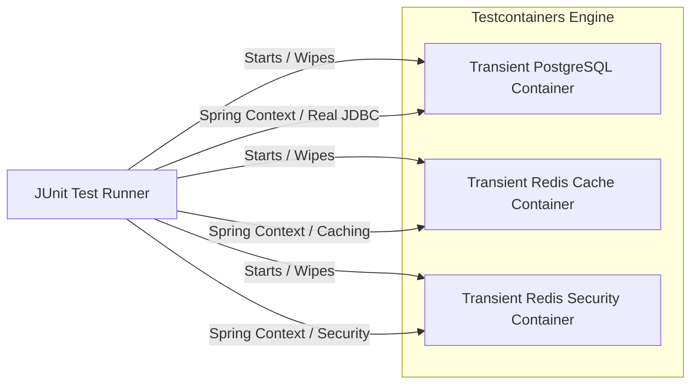

# Testing Strategy & Test Plan

To maintain stability, prevent regressions, and verify security controls, CloudShare employs a strict multi-layered automated testing pipeline.

---

## 1. The Testing Pyramid

CloudShare aligns with the standard software testing pyramid, focusing heavily on fast, isolated unit tests, backed by integration tests using real backing services, and light end-to-end API validations.

```
       / \
      / E \   <-- End-to-End API / Contract Tests (10%)
     /  I  \  <-- Integration Tests with Testcontainers (20%)
    /   U   \ <-- Unit Tests (JUnit 5 + Mockito) (70%)
   /_________\
```

---

## 2. Unit Testing (JUnit 5 + Mockito)

Unit tests focus on validating core business logic in isolation. All external dependencies (Database Repositories, Redis Clients, S3 Storage adapters, ClamAV connectors) are stubbed or mocked using **Mockito**.

*   **Frameworks:** JUnit 5 (Jupyter), Mockito, AssertJ.
*   **Execution Criteria:** Must run in memory in < 1 second per test class.
*   **Target Coverage:** Enforces a minimum 60% instruction coverage gate at the project bundle level via the `jacoco-maven-plugin` check goal (`jacoco:check`) during the Maven `verify` phase. Developers should target at least 80% line coverage for new services and utilities.

### Example Unit Test Case (File Ownership Validation)
```java
@ExtendWith(MockitoExtension.class)
class FileServiceTest {

    @Mock
    private FileRepository fileRepository;

    @InjectMocks
    private FileServiceImpl fileService;

    @Test
    void deleteFile_UserNotOwner_ThrowsAccessDeniedException() {
        // Arrange
        UUID fileId = UUID.randomUUID();
        UUID ownerId = UUID.randomUUID();
        UUID attackerId = UUID.randomUUID();

        FileMetadata metadata = new FileMetadata();
        metadata.setId(fileId);
        metadata.setOwnerId(ownerId);

        when(fileRepository.findById(fileId)).thenReturn(Optional.of(metadata));

        // Act & Assert
        assertThrows(AccessDeniedException.class, () -> {
            fileService.deleteFile(fileId, attackerId);
        });
        
        verify(fileRepository, never()).delete(any());
    }
}
```

---

## 3. Integration Testing (Testcontainers & MockMvc)

Mocking the database or cache can lead to false-positive tests since mock interfaces cannot validate actual SQL syntax, database constraint violations, or Redis connection timeouts.

CloudShare uses **Testcontainers** to orchestrate transient Docker instances of **PostgreSQL** and **Redis** for integration tests, running on the developer machine and the CI pipeline.



### 3.1 Testcontainers Abstract Configuration
```java
@SpringBootTest(webEnvironment = SpringBootTest.WebEnvironment.RANDOM_PORT)
@ActiveProfiles("test")
public abstract class BaseIntegrationTest {

    static final PostgreSQLContainer<?> postgres = new PostgreSQLContainer<>("postgres:16-alpine")
            .withDatabaseName("cloudshare_test")
            .withUsername("test_user")
            .withPassword("test_pass");

    // Container for general application metadata caching
    static final GenericContainer<?> redisCache = new GenericContainer<>("redis:7-alpine")
            .withExposedPorts(6379);

    // Container for security blacklists, OTP sessions, and rate-limiting
    static final GenericContainer<?> redisSecurity = new GenericContainer<>("redis:7-alpine")
            .withExposedPorts(6379);

    static {
        postgres.start();
        redisCache.start();
        redisSecurity.start();
    }

    @DynamicPropertySource
    static void configureProperties(DynamicPropertyRegistry registry) {
        // Database connection pool mappings
        registry.add("spring.datasource.url", postgres::getJdbcUrl);
        registry.add("spring.datasource.username", postgres::getUsername);
        registry.add("spring.datasource.password", postgres::getPassword);
        
        // Cache instance mappings
        registry.add("spring.data.redis.host", redisCache::getHost);
        registry.add("spring.data.redis.port", () -> redisCache.getMappedPort(6379));

        // Security / Rate limiter instance mappings
        registry.add("security.redis.host", redisSecurity::getHost);
        registry.add("security.redis.port", () -> redisSecurity.getMappedPort(6379));
    }
}
```

### 3.2 Web Layer Testing (`MockMvc`)
REST endpoints are validated using Spring `MockMvc` to test controller routing, request serialization, validation error triggers, and Spring Security filters (checking that invalid tokens return `401 Unauthorized`).

---

## 4. Static Code & Security Analysis

To enforce code style consistency and discover security vulnerabilities during early compilation, the Maven build incorporates these analyzers:

| Tool | Focus Area | Maven / Docker Execution Command |
| :--- | :--- | :--- |
| **Checkstyle** | Format guidelines, naming conventions, import ordering. | `mvn checkstyle:check` |
| **SpotBugs** | NullPointer dangers, resource leaks, basic logical bugs. | `mvn spotbugs:check` |
| **OWASP Dependency Check** | Scans `pom.xml` dependencies for known CVE vulnerabilities (SCA). | `mvn dependency-check:check -Psecurity-scan` |
| **Trivy Container Scan** | Scans the built Docker image for base OS and library vulnerabilities. | `docker build -t app . && trivy image app` |

---

## 5. Load & Performance Testing (Gatling)

File uploads and downloads create distinct IO bottlenecks. CloudShare specifies a **Gatling** simulation suite to verify concurrency capacity and streaming throughput under load.

*   **Simulation Class:** [CloudShareLoadTest.java](file:///d:/github/cloudshare-app/src/test/java/com/cloudshare/performance/CloudShareLoadTest.java)
*   **Test Scenario:** Simulates a ramp-up of 100 concurrent virtual users over 30 seconds. Each virtual user utilizes a dynamically generated username/password feeder to perform:
    1.  **Register:** Post user registration (`POST /api/v1/auth/register`).
    2.  **Login:** Authenticate and retrieve bearer token (`POST /api/v1/auth/login`).
    3.  **Upload:** Stream a 10MB random data file to storage (`POST /api/v1/files/upload`).
    4.  **List:** Query the active user file dashboard list (`GET /api/v1/files`).
    5.  **Download:** Fetch the uploaded 10MB payload to verify streaming integrity (`GET /api/v1/files/{fileId}/download`).
*   **Key Performance Indicators (KPIs):**
    *   95th Percentile API Latency: `< 200ms` for API requests (Register, Login, List).
    *   95th Percentile Streaming Latency: `< 1500ms` for 10MB file uploads and downloads.
    *   Error Rate: `< 0.1%` under peak concurrency.
*   **Local Execution Command:**
    ```bash
    mvn clean verify -Pperformance -Dgatling.baseUrl=https://localhost -Dgatling.insecure=true
    ```

